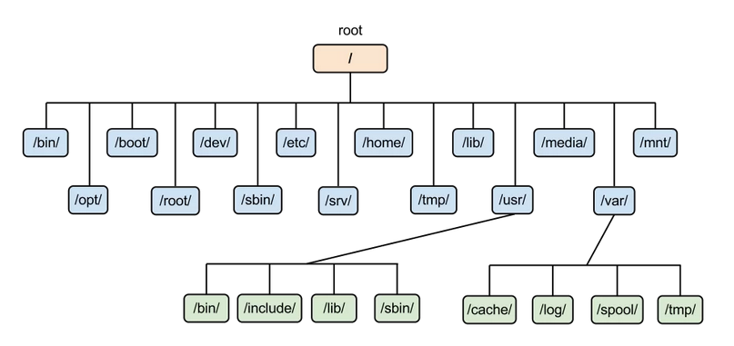

<h1 align='center'>Основы Linux</h1>

<h3>Содержание:</h3>
&emsp;&emsp;1. Общие сведения о Unix-системах;

&emsp;&emsp;2. Структура файловой системы;

<h3 align='center'>Тема 1: Общие сведения о Unix-системах</h3>

<h3 align='center'>Тема 2: Структура файловой системы</h3>

<h4>&emsp;&emsp;&emsp;&emsp;Структура каталогов в сравнении с ОС Windows</h4>

&emsp;&emsp;&emsp;&emsp;Представим обычную ситуацию, при которой, мы подключаем новый диск к компьютеру на базе ОС Windows. Что происходит после подключения? Ответ простой - каждый новый диск представляет собой обособленный каталог со своим корнем. Иными словами, корневых каталогов может быть несколько. В Linux же, наоборот, каждое новое устройство подключается к одному корню, т.е. при данной файловой структуре не диски содержат каталоги, а каталог — диски.

<h4>&emsp;&emsp;&emsp;&emsp;Стандарт иерархии файловой системы</h4>

&emsp;&emsp;&emsp;&emsp;<b>Filesystem Hierarchy Standart (FHS)</b> - стандарт, унифицирующий местонахождение файлов и каталогов с общим назначением в файловой системе UNIX.

&emsp;&emsp;- <b>/</b> - Самый главный каталог в системе, который содержит в себе все остальные;

&emsp;&emsp;- <b>/bin</b> - Каталог, который содержит в себе двоичные исполняемые файлы команд (например, cat, pwd, ls и др.);

&emsp;&emsp;- <b>/opt</b> - дополнительные приложения системы (пакеты программного обеспечения);

&emsp;&emsp;- <b>/boot</b> - Здесь расположены файлы для начальной загрузки (образ initrd, а также ядро vmlinuz);

&emsp;&emsp;- <b>/root</b> - Директория, которая содержит файлы и личные настройки суперпользователя;

&emsp;&emsp;- <b>/dev</b> - Драйверы для взаимодействия с другими устройствами;

&emsp;&emsp;- <b>/etc</b> - Файлы конфигурации различных программ;

&emsp;&emsp;- <b>/srv</b> - Содержит файлы сервисов, предоставляемых сервером (Apache, FTP и др.);

&emsp;&emsp;- <b>/home</b> - Каталог, где содержатся домашние каталоги пользователей системы;

&emsp;&emsp;- <b>/tmp</b> - Хранит в себе временные файлы (очищается при повторном запуске системы);

&emsp;&emsp;- <b>/lib</b> - Содержит системные библиотеки, с которыми работают программы и модули ядра;

&emsp;&emsp;- <b>/usr</b> - Содержит пользовательские приложения и утилиты, используемые пользователями, а не системой;

&emsp;&emsp;- <b>/media</b> - Точка, куда монтируются внешние носители;

&emsp;&emsp;- <b>/var</b> - Содержит переменные файлы. Имеет подкаталоги, отвечающие за отдельные переменные;

&emsp;&emsp;- <b>/mnt</b> - Точка временного монтирования устройств;

&emsp;&emsp;- <b>/proc</b> - Содержит файлы, хранящие информацию о запущенных процессах и о состоянии ядра ОС;

&emsp;&emsp;- <b>/sys</b> - Содержит данные непосредственно о системе. Тут можно узнать информацию о ядре, драйверах и устройствах.

